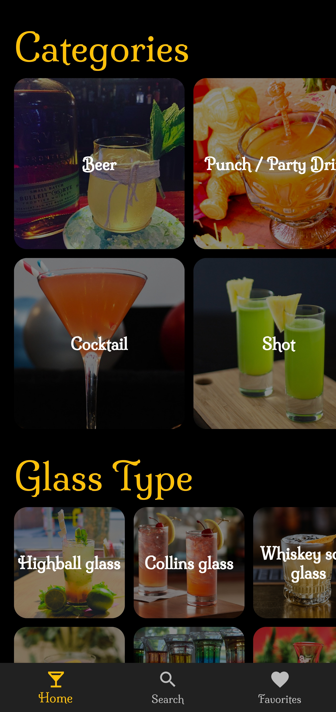
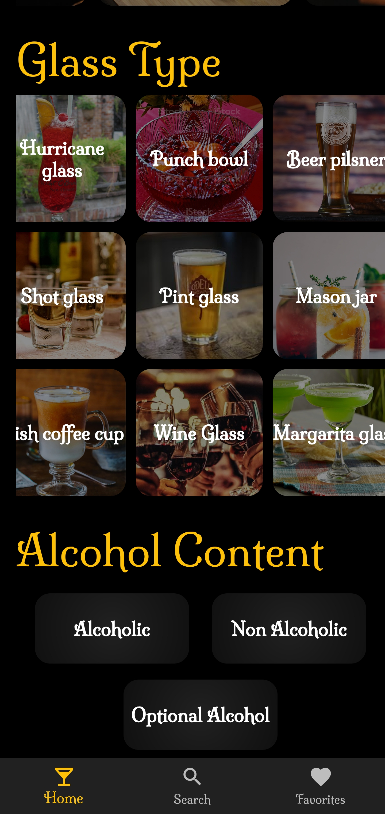
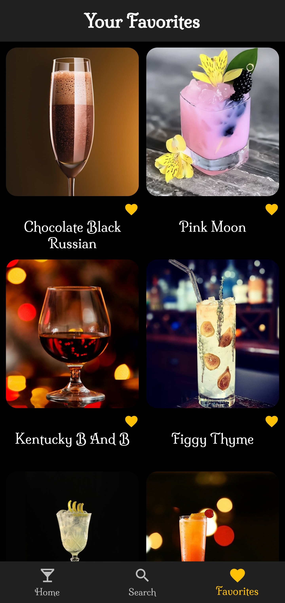
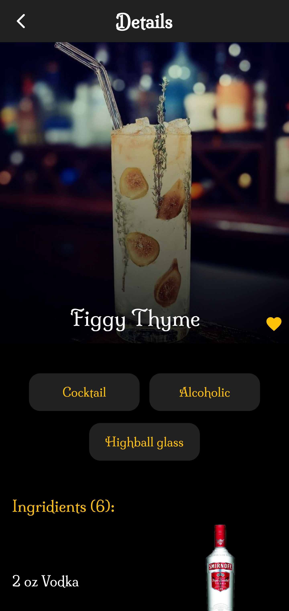
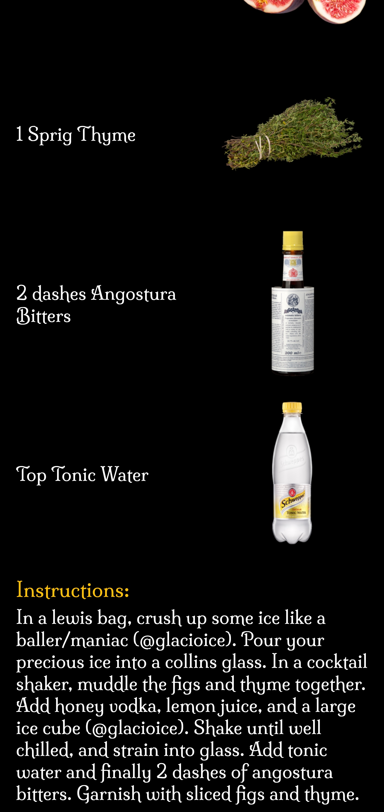
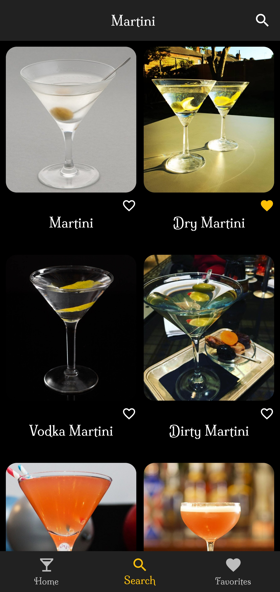
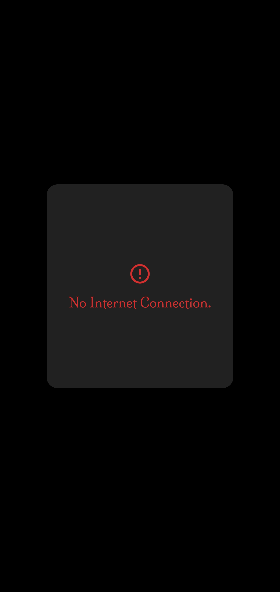

# Drinks Wiki

A Flutter App that will fullfill all your drinking urges. Filter drinks by Category, Glass Type and Alcohol Content. Get detailed list of Ingridients with pictures.
Add Favorites that survive app restarts. 

# Run The App on Your Android Device Now
Download the APK from here
[Click Here To Go To The Downloads Page](https://github.com/ankanSikdar/flutter-drinks-wiki/releases/ "Releases Page")

## Details
This project is made using the [CocktailDB](https://www.thecocktaildb.com/ "Cocktail DB") api. [BLOC](https://bloclibrary.dev/ "BLOC") library is used to manage the state of favorite drinks. [Shared Preferences](https://pub.dev/packages/shared_preferences "Shared Preferences") is used to store the favorites in device and load it up when the app is opened again. [Milonga](https://fonts.google.com/specimen/Milonga "Milonga Font") is used as the font.

## Screenshots
      

## Getting Started

This project is a starting point for a Flutter application.

A few resources to get you started if this is your first Flutter project:

- [Lab: Write your first Flutter app](https://flutter.dev/docs/get-started/codelab)
- [Cookbook: Useful Flutter samples](https://flutter.dev/docs/cookbook)

For help getting started with Flutter, view our
[online documentation](https://flutter.dev/docs), which offers tutorials,
samples, guidance on mobile development, and a full API reference.
